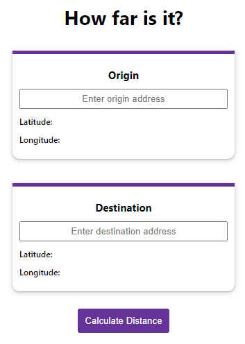
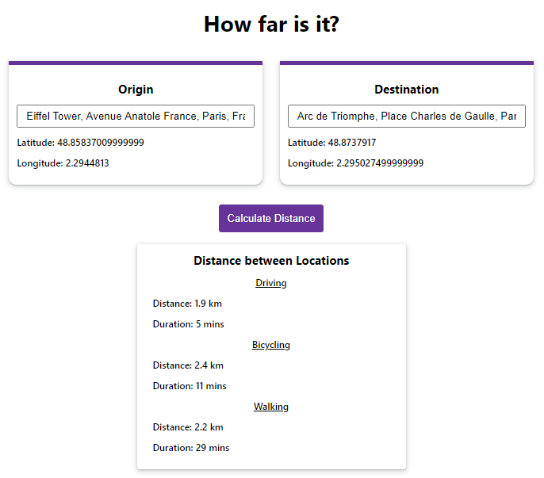
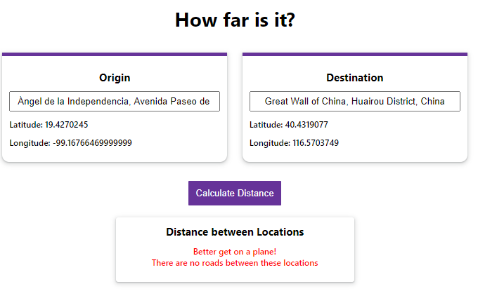
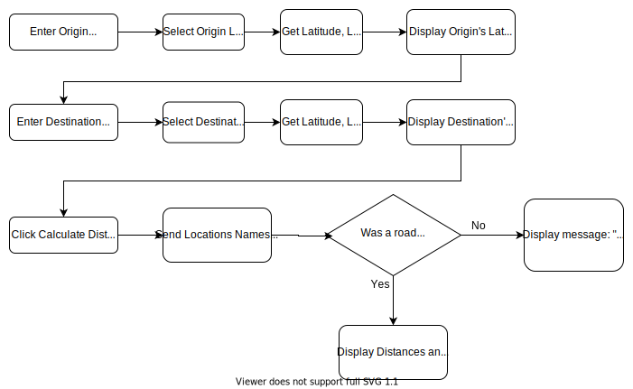

# Distance Calculator

This app will let you know the distance between 2 locations.


## Technologies used

Built with React, Sass, and Google Maps API

  
## Demo

This application is deployed at http://distance-calculator.vercel.app/

  
## How to Use

- Enter Origin Location
- Enter Destination Location
- Click Calculate Distance
- If there&apos;s a road between the locations, the distance and duration of different transit modalities is shown (Drive, Bike, and Walk)

  
## Screenshots



 




## How does it work



## Run Locally

You can clone the project and run it on your own computer. Make the changes you want.

```bash
  git clone https://github.com/iqrivas/distance-calculator.git
```

Go to the project directory

```bash
  cd distance-calculator
```

Install dependencies

```bash
  npm install
```

Start the server

```bash
  npm run start
```
